# Continuous Learning Repository

## Currently Learning

### [Complete Intro to Databases](https://frontendmasters.com/courses/databases/)

**Date Started:** November 12th

### [Deep JavaScript Foundations](https://frontendmasters.com/courses/deep-javascript-v3/)

**Date Started:** November 19th

### [TypeScript Fundamentals](https://frontendmasters.com/courses/typescript-v4/)

**Date Started:** November 25th

### [Introducing DevOps for Developers](https://frontendmasters.com/courses/devops/)

**Date Started:** November 26th

## Certificates Completed (Newest to Oldest)

### [Mastering the Design Process](https://frontendmasters.com/courses/design-process/)

**What I learned:** I learned about design principles, how to give presentations about designs, how to ask good queastions, wireframing, high fidelity mockups.

**Date Started:** December 1st

**Date Ended:** December 4th

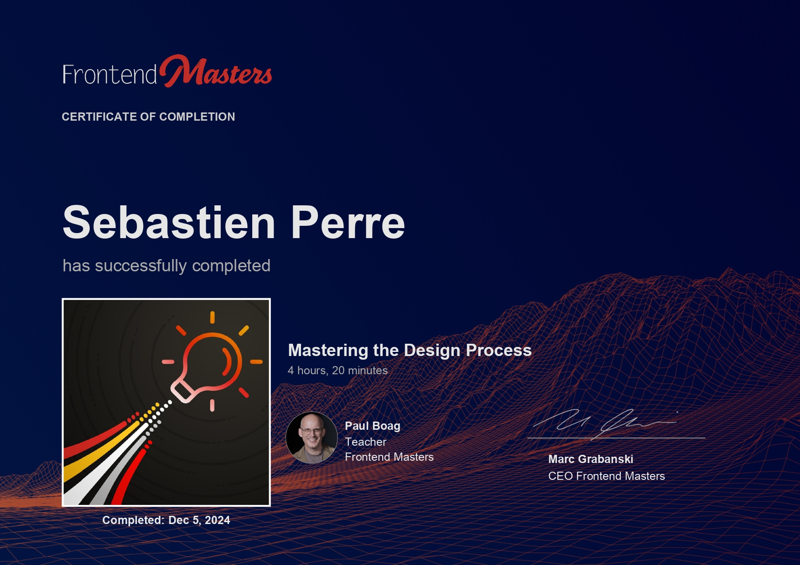

### [Interviewing for Frontend Engineers](https://frontendmasters.com/courses/interviewing-frontend/)

**What I learned:** I learned how interview generally go for developer job, practiced questions for the prescreen, code test, phone screen and on-site interivew.

**Date Started:** November 28th

**Date Ended:** November 29th

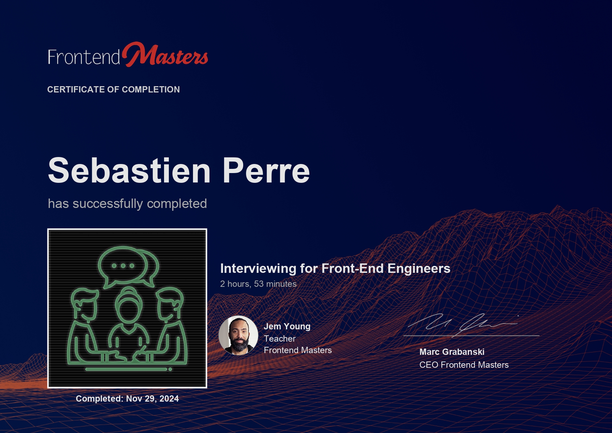

### [Introduction to Next.js](https://frontendmasters.com/courses/next-js-v3/)

**What I learned:** I learned how to create a next app, server components, client components, Prisma, server actions, api routes, middleware, and deploying to vercel.

**Date Started:** November 25th

**Date Ended:** November 28th

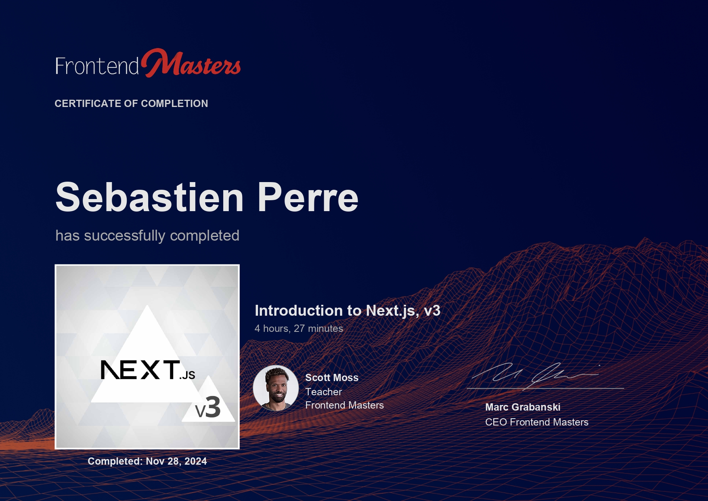

### [AWS for Frontend Engineers](https://frontendmasters.com/courses/aws-v2/)

**What I learned:** I learned how to use AWS, IAM, S3, Cloudfront, and Lambda.

**Date Started:** November 20th

**Date Completed:** November 26th

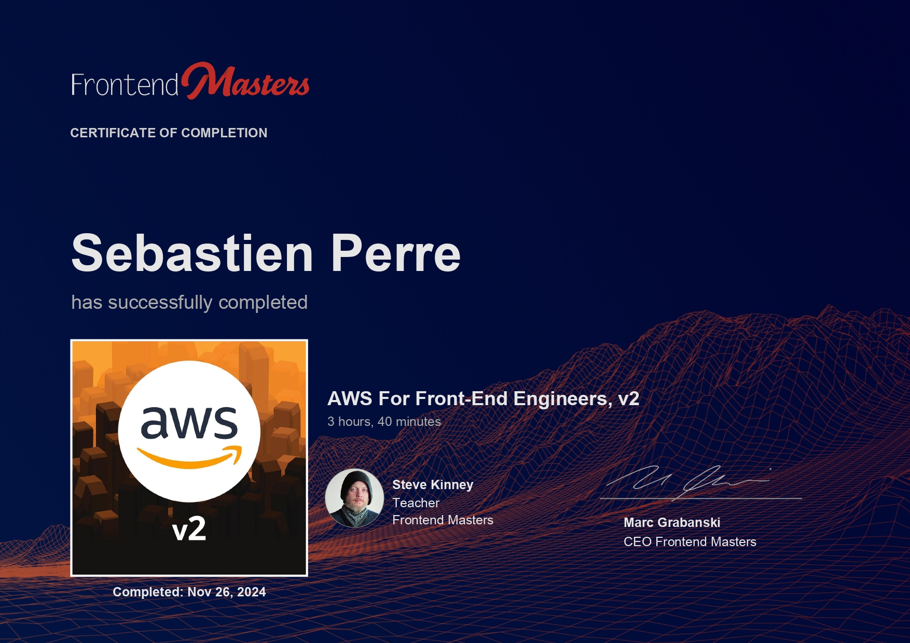

### [Search Engine Optimization (SEO)](https://frontendmasters.com/courses/modern-seo/)

**What I learned:** I leared all about SEO, how to optimize a website, use meta tags, how to implement social metadata, and AMP.

**Date Started:** November 13th

**Date Completed:** November 24th

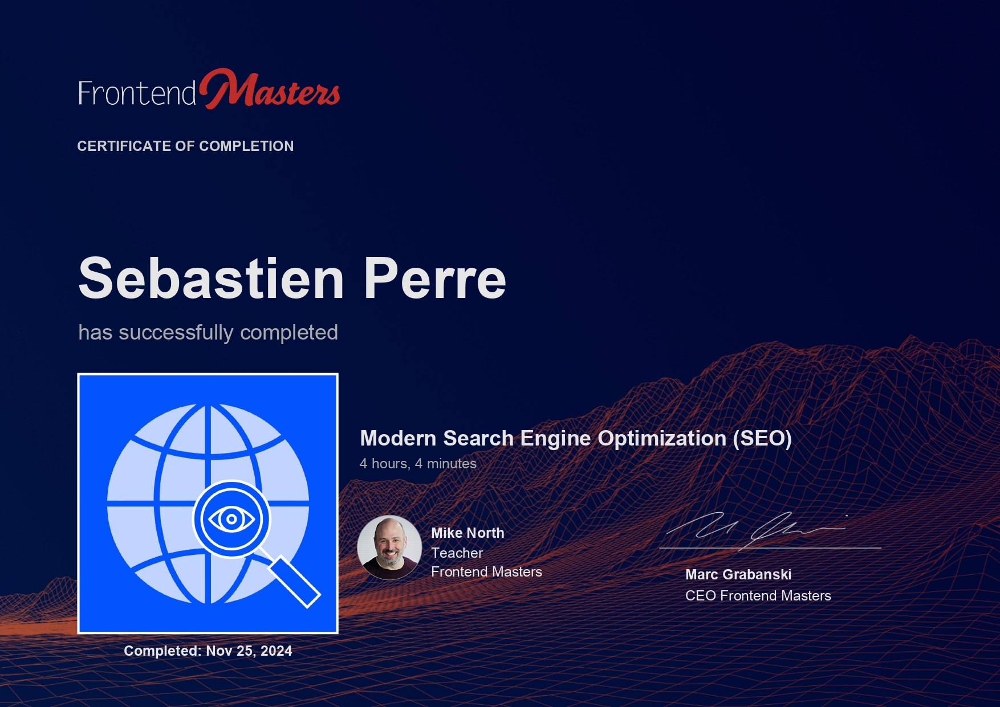

### [Introduction To Dev Tools](https://frontendmasters.com/courses/dev-tools/)

**What I learned:** I learned how to use the dev tools such as quick edits, workspaces, network tab, performance tab, lighthouse.

**Date Started:** November 12th

**Date Completed:** November 24th

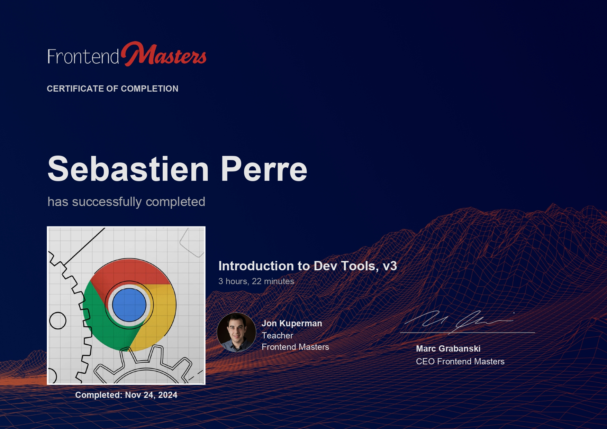

### [Complete Intro to Containers](https://frontendmasters.com/courses/complete-intro-containers-v2/)

**What I learned:** I learned what a container is made up of, how to create one by hand, docker, docker compose, kubernetes, and Kompose.

**Date Started:** November 9th

**Date Completed:** November 18th

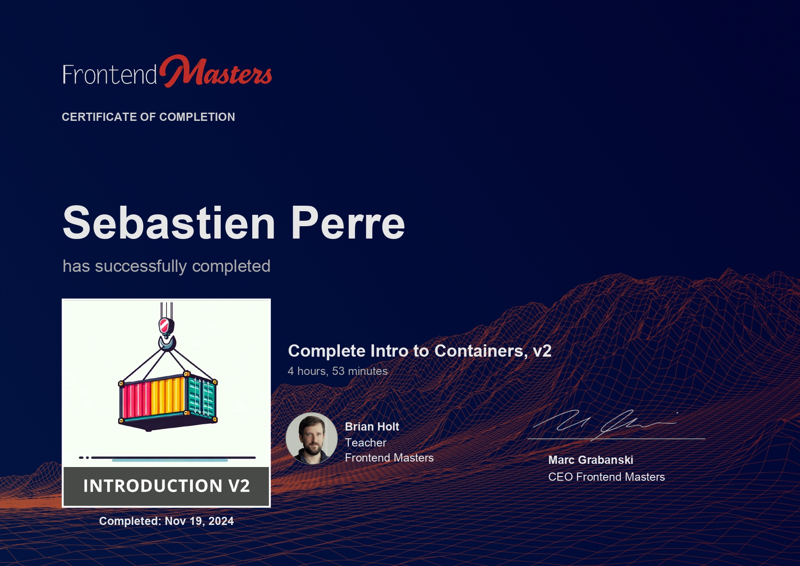

### [JavaScript: The Hard Parts](https://frontendmasters.com/courses/javascript-hard-parts-v2/)

**What I learned:** I learned about higher order functions, closure, how asynchronous javascript works (promises, event loop, etc.), how class and OOP works, etc.

**Date Started:** November 13th

**Date Completed:** November 17th

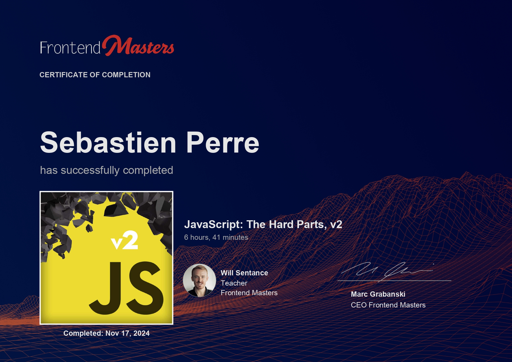

### [Software Developer Success: Soft Skills & Testing](https://frontendmasters.com/courses/dev-soft-skills/)

**What I learned:** I learned about how soft skills can accelerate your career, techniques on how to apply them in your worklife, code refactoring, test driven development, etc.

**Date Started:** November 7th

**Date Completed:** November 13th

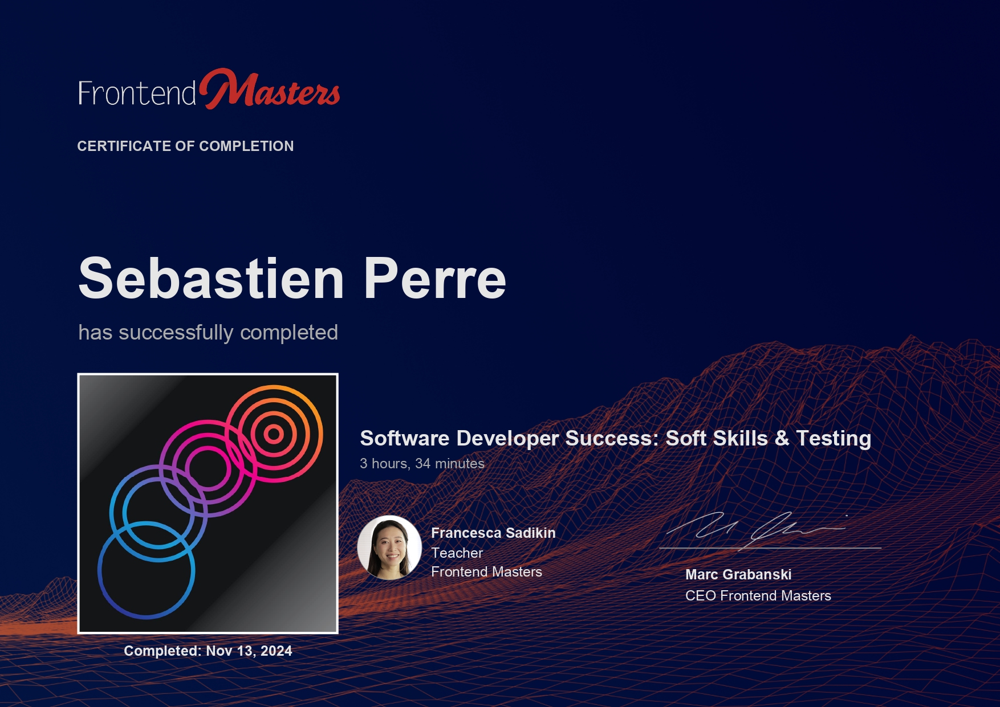

### [JavaScript: From First Steps to Professional](https://frontendmasters.com/courses/javascript-first-steps/)

**What I learned:** Great refresher on javascript basics, how to call an API, modules, etc.

**Date Started:** November 8th

**Date Completed:** November 13th

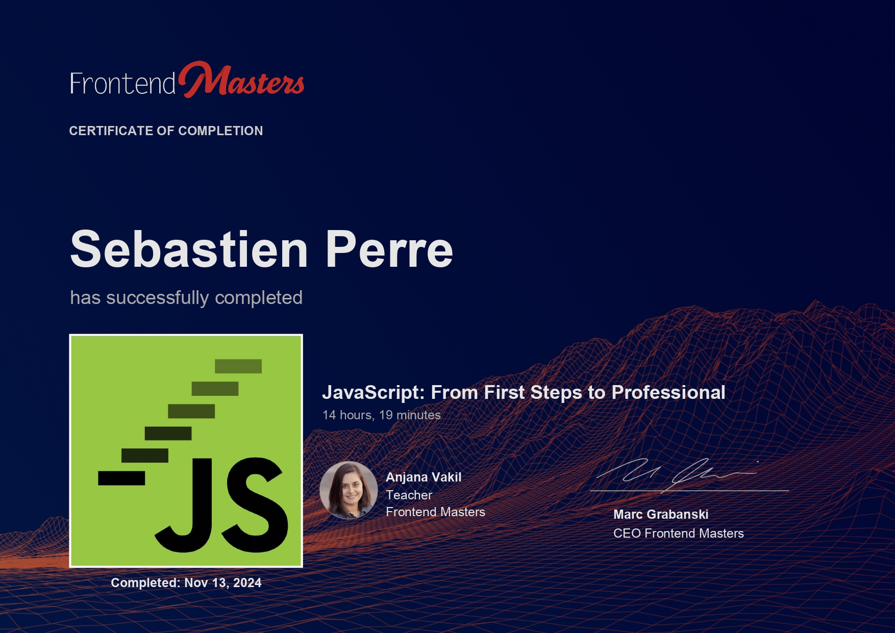

### [Getting a Software Enginnering Job](https://frontendmasters.com/courses/getting-a-job-v3/)

**What I learned:"** Learned about the tech market and how to optimize my github, linkedin, networking abilities, website, etc.

**Date Started:** November 10th

**Date Completed:** November 13th

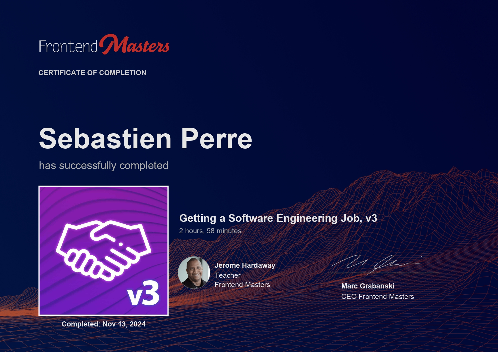

### [Introduction to Node.js](https://frontendmasters.com/courses/node-js-v3/)

**What I learned:** Learned how to use Javascript with the node environment, installing packages with npm, using yargs, using fs, unit testing with Jest, setting up a server, etc.

**Date Started:** November 9th, 2024

**Date Completed:** November 12th, 2024

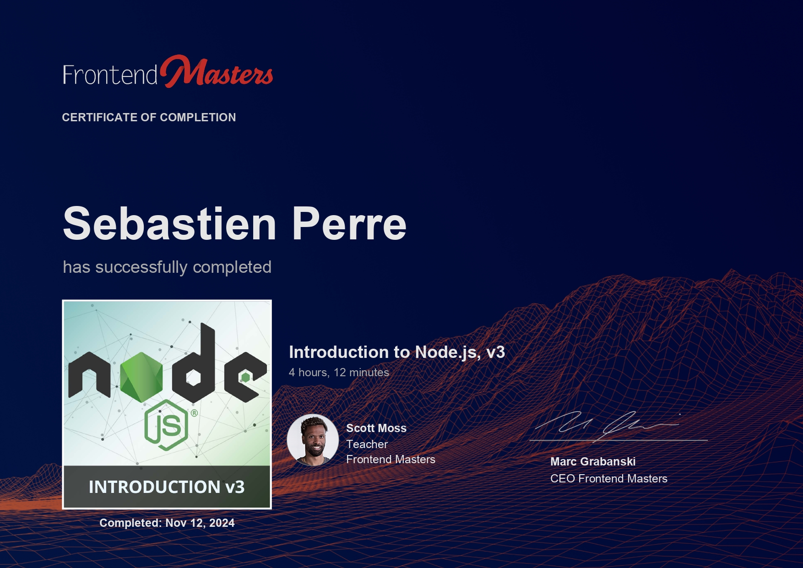

### [Complete Intro to Web Development](https://frontendmasters.com/courses/web-development-v3/)

**What I learned:** Learned how to use Javascript with the DOM, refresh on HTML, refresh on CSS, learned how to communicate with APIs, etc.

**Date Started:** November 3rd, 2024

**Date Completed:** November 11th, 2024

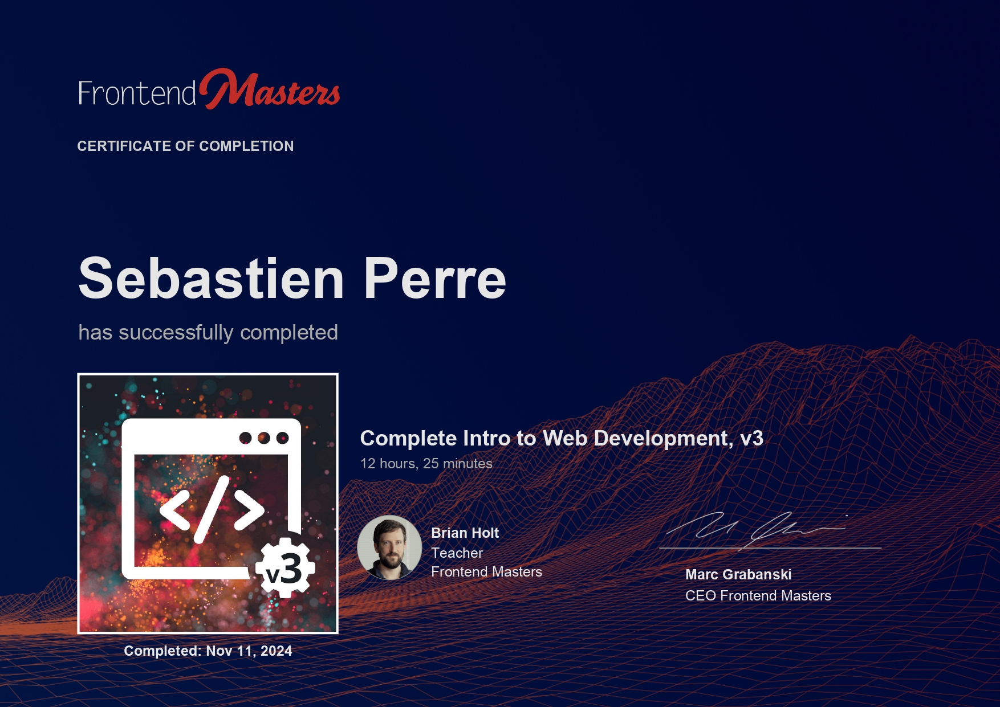

### [Getting Started with JavaScript](https://frontendmasters.com/courses/getting-started-javascript-v2/)

**What I learned:** Great refresh of JavaScript, coercion, scope, closure, prototypes, etc.

**Date Started:** November 5th, 2024

**Date Completed:** November 11th, 2024

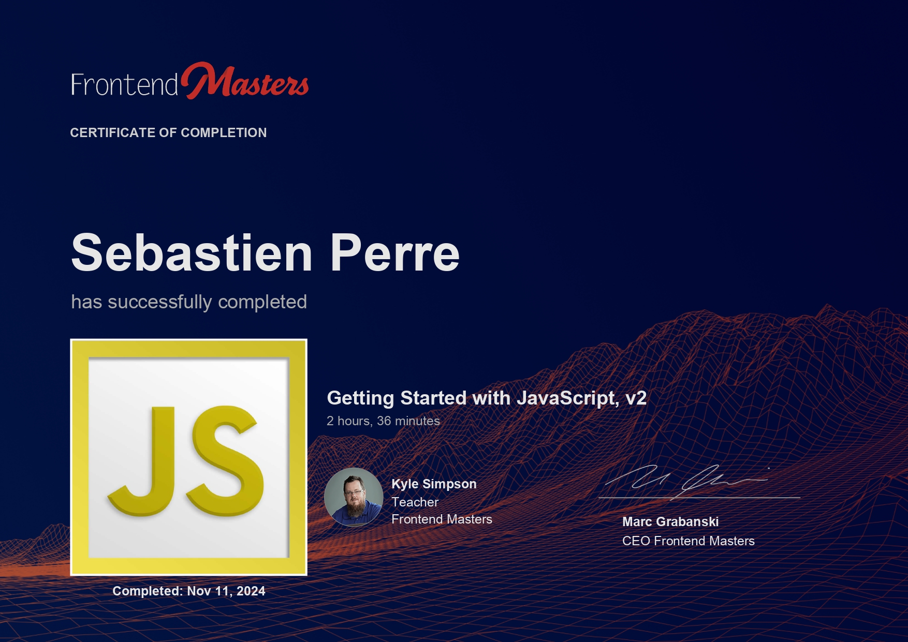

### [Vim Fundamentals](https://frontendmasters.com/courses/vim-fundamentals/)

**What I learned:** Learned how to use the VIM text editor, buffers, remaps, bunch of shortcuts, plugins, themes, etc.

**Date Started:** November 1st, 2024

**Date Completed:** November 4th, 2024

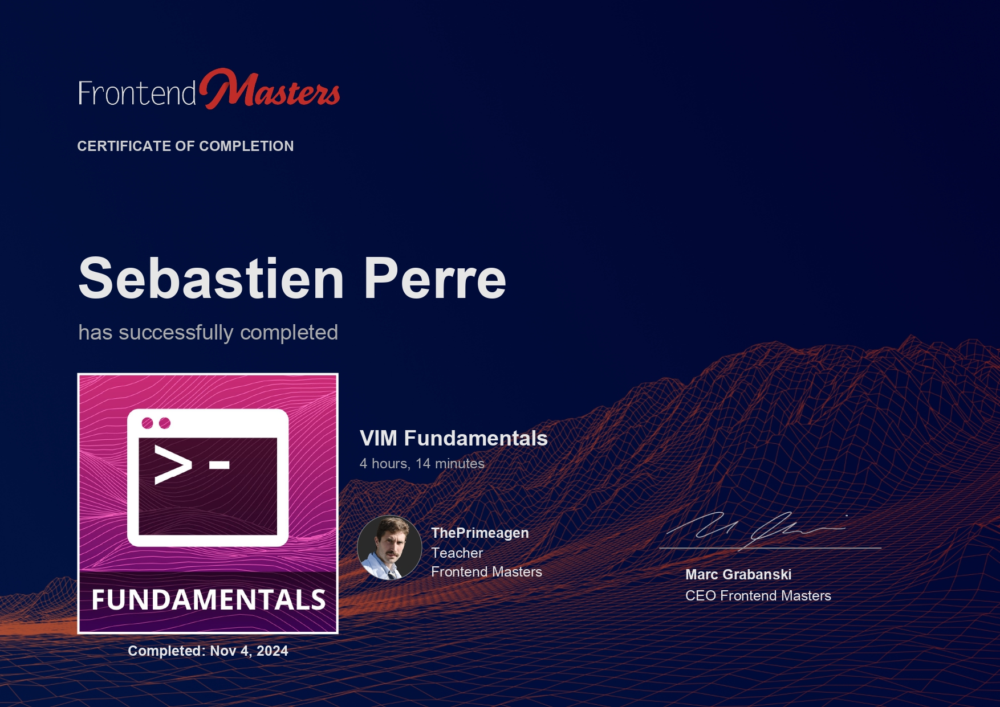

### [Complete Intro to Linux and the Command Line](https://frontendmasters.com/courses/linux-command-line/)

**What I learned:** Learned more on how to use the Bash, commands, pipes, environments, processes, SFTP, SSH, curl, package manager, bash scripting, cron, etc.

**Date Started:** October 31st, 2024

**Date Completed:** November 3rd, 2024

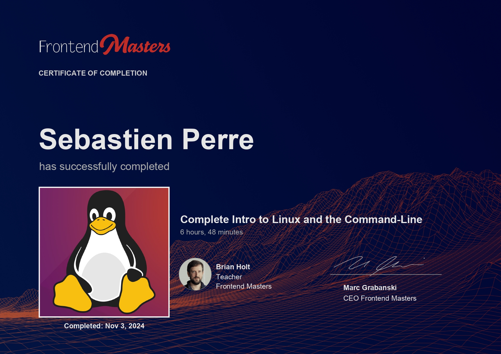

### [API Design in Node.js](https://frontendmasters.com/courses/api-design-nodejs-v4/)

**What I learned:** I learned how to use Node.js such as how to run it, set it up, REST API theory, express, routes, middleware, thunder client, JWTs, route validation, deployment to Render, etc.

**Date Started:** October 20th, 2024

**Date Completed:** October 26th, 2024

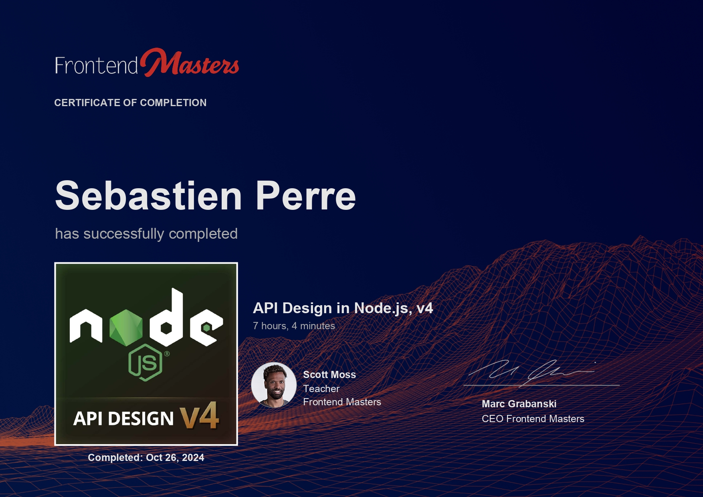

### [Complete Intro to React](https://frontendmasters.com/courses/complete-react-v8/)

**What I learned:** I learned the react framework such as how to run it, set it up, hooks, effects, modals, portals, react query, contexts, etc.

**Date Started:** October 17th, 2024

**Date Completed:** October 21st, 2024

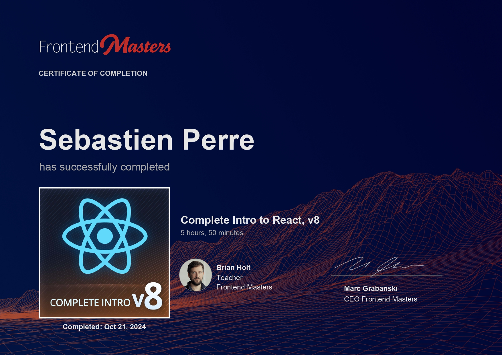
