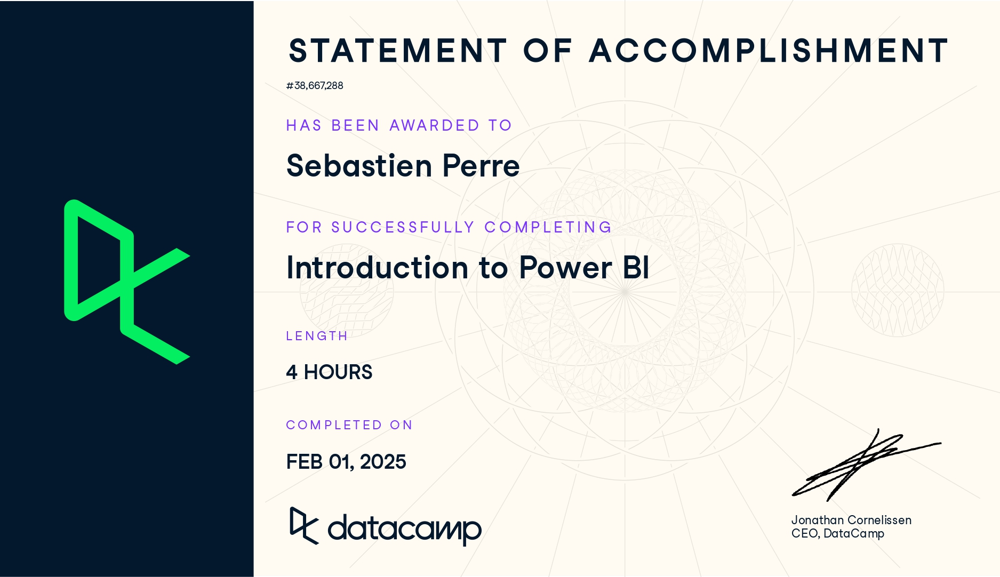

# Continuous Learning Repository

## Currently Learning

### [Learn PyTorch for deep learning in a day. Literally.](https://www.youtube.com/watch?v=Z_ikDlimN6A&t=76s&ab_channel=DanielBourke)

**Date Started:** March 5th

**Progress:** 7:17:30

### [Learning Go: An Idiomatic Approach to Real-World Go Programming](https://www.amazon.ca/Learning-Go-Idiomatic-Real-World-Programming/dp/1098139291/ref=pd_lpo_d_sccl_1/132-4621172-6024108?pd_rd_w=Yqb3L&content-id=amzn1.sym.d3f44101-6e04-446e-916c-a6ec5616982b&pf_rd_p=d3f44101-6e04-446e-916c-a6ec5616982b&pf_rd_r=B74ZW8ME5F4BEDWV8Y8W&pd_rd_wg=zdLla&pd_rd_r=ca68733c-4d4f-4b49-9cd0-58007570a010&pd_rd_i=1098139291&psc=1)

**Date Started:** Feburary 18th

**Progress:** On Chapter 4 (Page 107)

### [Competitive Programmer’s Handbook](https://cses.fi/book/book.pdf)

**Date Started:** January 10th

**Date Started:** Page 115

## Books, Certificates, and Courses Completed (Newest to Oldest)

### [Low Poly Character Modeling](https://www.youtube.com/watch?v=PTWV67qUX2k&ab_channel=Imphenzia)

**What I learned:** How to create low poly characters, texture them with UV maps, rig them and animate them.

**Date Started: Feburary 10th**

**Date Ended: Feburary 14th**

### [Introduction to DAX in Power BI](https://app.datacamp.com/learn/courses/introduction-to-dax-in-power-bi)

**What I learned:** Learned about DAX commands, columns, measures, variables, context in DAX, iterators, and working with dates.

**Date Started:** Feburary 1st

**Date Ended:** Feburary 1st

### [Introduction to Power BI](https://app.datacamp.com/learn/courses/introduction-to-power-bi)

**What I learned:** Learned about different visualizations, importing data, formatting data, power query, and filtering.

**Date Started:** January 31st

**Date Ended:** Febuary 1st

### [Introduction to Apache Kafka](https://app.datacamp.com/learn/courses/introduction-to-apache-kafka)

**What I learned:** Learned about the basic of Kafka and Zookeeper, how to setup and run Kafka and Zookeeper, topics, consumers, producers, partitions, replication, deleting a topic and troubleshooting.

**Date Started:** January 25th

**Date Ended:** January 26th

### [Introduction to SQL](https://app.datacamp.com/learn/courses/introduction-to-sql)

**What I learned:** Learned what SQL is, did various queries, used views and understood differences between SQL Server and PostgreSQL.

**Date Started:** January 24th

**Date Completed:** January 24th

### [Introduction to R](https://app.datacamp.com/learn/courses/free-introduction-to-r)

**What I learned:** A great refresher on R. Went through basic R operations, vectors, matrices, factors, data frames, and lists

**Date Started:** January 23rd, 2025

**Date Ended:** January 23rd, 2025

### [Web UX Design for High Converting Websites](https://frontendmasters.com/courses/ux-design-principles/)

**What I learned:** I learned about dark patterns, reducing cognitive load, creating a value proposition, optimizing for conversion and user testing, etc.

**Date Started:** December 16th, 2024

**Date Ended:** December 22nd, 2024

### [Mastering the Design Process](https://frontendmasters.com/courses/design-process/)

**What I learned:** I learned about design principles, how to give presentations about designs, how to ask good queastions, wireframing, high fidelity mockups.

**Date Started:** December 1st, 2024

**Date Ended:** December 4th, 2024

### [Interviewing for Frontend Engineers](https://frontendmasters.com/courses/interviewing-frontend/)

**What I learned:** I learned how interview generally go for developer job, practiced questions for the prescreen, code test, phone screen and on-site interivew.

**Date Started:** November 28th, 2024

**Date Ended:** November 29th, 2024

### [Introduction to Next.js](https://frontendmasters.com/courses/next-js-v3/)

**What I learned:** I learned how to create a next app, server components, client components, Prisma, server actions, api routes, middleware, and deploying to vercel.

**Date Started:** November 25th, 2024

**Date Ended:** November 28th, 2024

### [AWS for Frontend Engineers](https://frontendmasters.com/courses/aws-v2/)

**What I learned:** I learned how to use AWS, IAM, S3, Cloudfront, and Lambda.

**Date Started:** November 20th, 2024

**Date Completed:** November 26th, 2024

### [Search Engine Optimization (SEO)](https://frontendmasters.com/courses/modern-seo/)

**What I learned:** I leared all about SEO, how to optimize a website, use meta tags, how to implement social metadata, and AMP.

**Date Started:** November 13th, 2024

**Date Completed:** November 24th, 2024

### [Introduction To Dev Tools](https://frontendmasters.com/courses/dev-tools/)

**What I learned:** I learned how to use the dev tools such as quick edits, workspaces, network tab, performance tab, lighthouse.

**Date Started:** November 12th, 2024

**Date Completed:** November 24th, 2024

### [Complete Intro to Containers](https://frontendmasters.com/courses/complete-intro-containers-v2/)

**What I learned:** I learned what a container is made up of, how to create one by hand, docker, docker compose, kubernetes, and Kompose.

**Date Started:** November 9th, 2024

**Date Completed:** November 18th, 2024

### [JavaScript: The Hard Parts](https://frontendmasters.com/courses/javascript-hard-parts-v2/)

**What I learned:** I learned about higher order functions, closure, how asynchronous javascript works (promises, event loop, etc.), how class and OOP works, etc.

**Date Started:** November 13th, 2024

**Date Completed:** November 17th, 2024

### [Software Developer Success: Soft Skills & Testing](https://frontendmasters.com/courses/dev-soft-skills/)

**What I learned:** I learned about how soft skills can accelerate your career, techniques on how to apply them in your worklife, code refactoring, test driven development, etc.

**Date Started:** November 7th, 2024

**Date Completed:** November 13th, 2024

### [JavaScript: From First Steps to Professional](https://frontendmasters.com/courses/javascript-first-steps/)

**What I learned:** Great refresher on javascript basics, how to call an API, modules, etc.

**Date Started:** November 8th, 2024

**Date Completed:** November 13th, 2024

### [Getting a Software Enginnering Job](https://frontendmasters.com/courses/getting-a-job-v3/)

**What I learned:"** Learned about the tech market and how to optimize my github, linkedin, networking abilities, website, etc.

**Date Started:** November 10th, 2024

**Date Completed:** November 13th, 2024

### [Introduction to Node.js](https://frontendmasters.com/courses/node-js-v3/)

**What I learned:** Learned how to use Javascript with the node environment, installing packages with npm, using yargs, using fs, unit testing with Jest, setting up a server, etc.

**Date Started:** November 9th, 2024

**Date Completed:** November 12th, 2024

### [Complete Intro to Web Development](https://frontendmasters.com/courses/web-development-v3/)

**What I learned:** Learned how to use Javascript with the DOM, refresh on HTML, refresh on CSS, learned how to communicate with APIs, etc.

**Date Started:** November 3rd, 2024

**Date Completed:** November 11th, 2024

### [Getting Started with JavaScript](https://frontendmasters.com/courses/getting-started-javascript-v2/)

**What I learned:** Great refresh of JavaScript, coercion, scope, closure, prototypes, etc.

**Date Started:** November 5th, 2024

**Date Completed:** November 11th, 2024

### [Vim Fundamentals](https://frontendmasters.com/courses/vim-fundamentals/)

**What I learned:** Learned how to use the VIM text editor, buffers, remaps, bunch of shortcuts, plugins, themes, etc.

**Date Started:** November 1st, 2024

**Date Completed:** November 4th, 2024

### [Complete Intro to Linux and the Command Line](https://frontendmasters.com/courses/linux-command-line/)

**What I learned:** Learned more on how to use the Bash, commands, pipes, environments, processes, SFTP, SSH, curl, package manager, bash scripting, cron, etc.

**Date Started:** October 31st, 2024

**Date Completed:** November 3rd, 2024

### [API Design in Node.js](https://frontendmasters.com/courses/api-design-nodejs-v4/)

**What I learned:** I learned how to use Node.js such as how to run it, set it up, REST API theory, express, routes, middleware, thunder client, JWTs, route validation, deployment to Render, etc.

**Date Started:** October 20th, 2024

**Date Completed:** October 26th, 2024

### [Complete Intro to React](https://frontendmasters.com/courses/complete-react-v8/)

**What I learned:** I learned the react framework such as how to run it, set it up, hooks, effects, modals, portals, react query, contexts, etc.

**Date Started:** October 17th, 2024

**Date Completed:** October 21st, 2024

